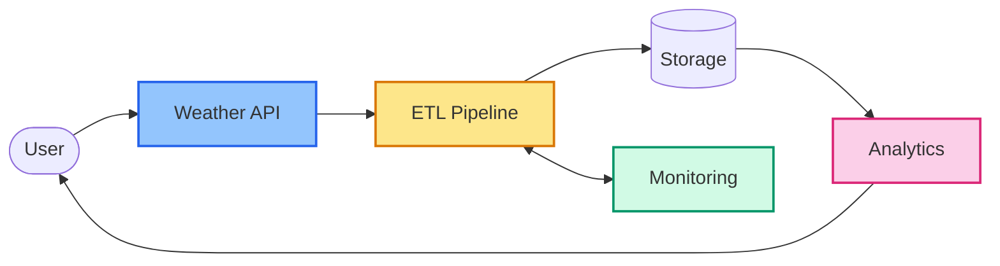
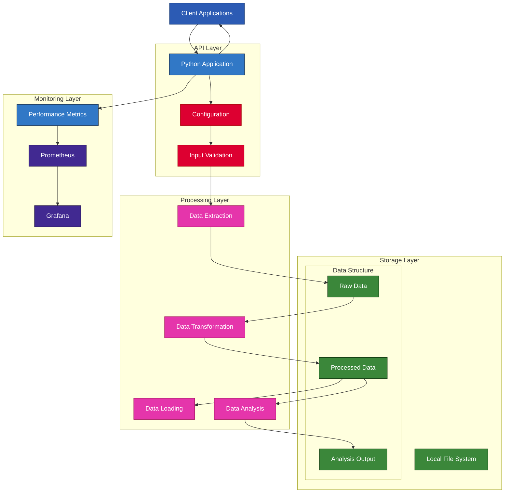
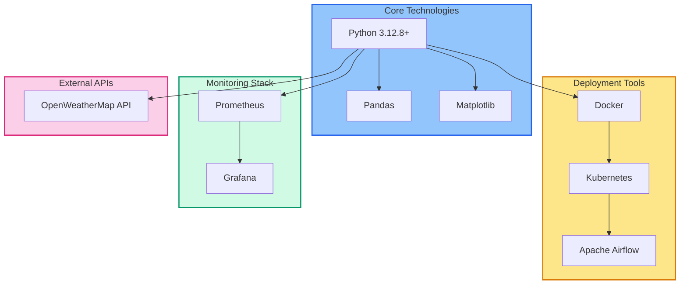
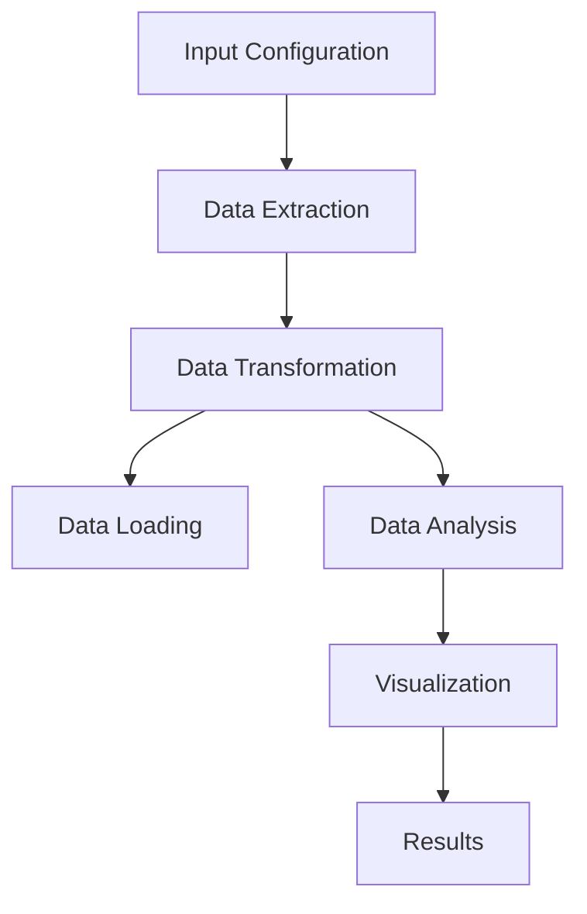
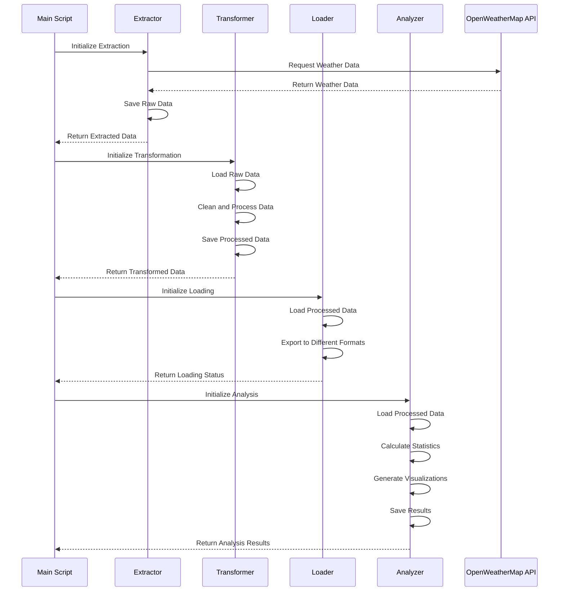
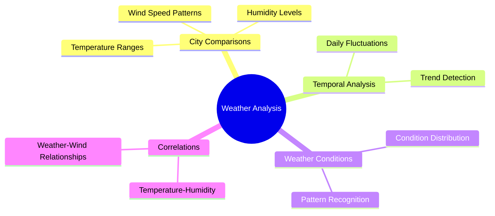
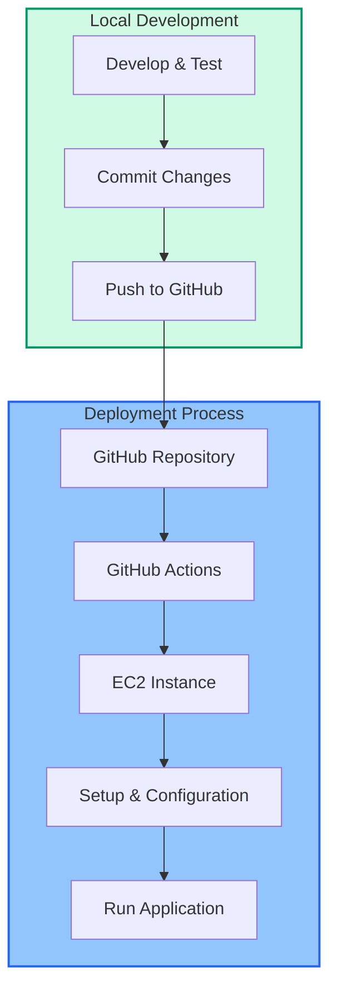
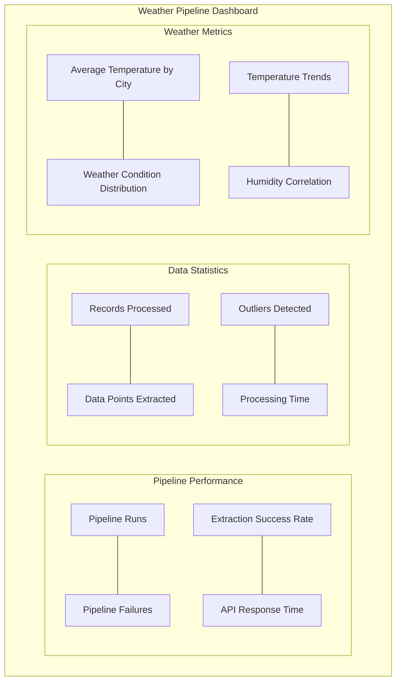

I'll update the license section and clarify the architecture regarding storage.

# **🌤️ OpenWeatherMap Data Pipeline Engineering Project**

<div align="center">
    <a href="https://github.com/yourusername/weather-data-pipeline/">
        
    </a>
</div>


---

## **📄 Overview**
The **OpenWeatherMap Data Pipeline Engineering Project** is a comprehensive data engineering solution that collects, processes, and analyzes weather data from the OpenWeatherMap API. It demonstrates a complete ETL (Extract, Transform, Load) pipeline with monitoring, visualization, and multiple deployment options, designed to deliver actionable weather insights across multiple cities.



---

### Architecture Flow


---

## **Table of Contents**
1. [🎯 Key Features](#-key-features)
2. [🔧 Technology Stack](#-technology-stack)
3. [📝 Project Structure](#-project-structure)
4. [🚀 Getting Started](#-getting-started)
5. [🔄 Processing Pipeline](#-processing-pipeline)
6. [📊 Data Analysis](#-data-analysis)
7. [🛠️ Deployment Options](#-deployment-options)
8. [🔍 Monitoring](#-monitoring)
9. [📚 References](#-references)
10. [📜 License](#-license)

---

## **🎯 Key Features**
- **☁️ Automated Weather Data Collection**
  - Multi-city weather data extraction
  - Configurable sampling frequency
  - Resilient API connectivity with retry logic

- **⚙️ Robust Data Processing**
  - Data cleaning and normalization
  - Outlier detection and handling
  - Derived metrics calculation

- **📊 Comprehensive Analytics**
  - City-to-city weather comparisons
  - Temperature trend analysis
  - Weather pattern visualization

- **☸️ Enterprise-Grade Infrastructure**
  - Docker containerization
  - Kubernetes orchestration
  - Multiple deployment options (local, EC2, Airflow)

---

## **🔧 Technology Stack**




**Core Dependencies:**
- **Python**: Primary development language
- **Pandas**: Data manipulation and analysis
- **Matplotlib**: Visualization and plotting
- **PyYAML**: Configuration handling
- **Requests**: API communication
- **SQLite**: Local database storage
- **Prometheus-client**: Metrics instrumentation

---

## **📝 Project Structure**
```plaintext
weather_data_pipeline/
├── README.md                     # Project documentation
├── config/
│   └── config.yaml               # Configuration parameters
├── data/
│   ├── raw/                      # Raw data storage
│   ├── processed/                # Processed data storage
│   └── output/                   # Final analysis output
├── logs/                         # Log files
├── requirements.txt              # Python dependencies
├── src/
│   ├── __init__.py
│   ├── extract.py                # Data extraction module
│   ├── transform.py              # Data transformation module
│   ├── load.py                   # Data loading module
│   ├── analyze.py                # Data analysis module
│   └── utils.py                  # Utility functions
├── main.py                       # Main execution script
├── Dockerfile                    # Docker configuration
├── docker-compose.yml            # Docker Compose setup
├── airflow/                      # Airflow DAG definitions
├── kubernetes/                   # Kubernetes deployment files
├── monitoring/                   # Prometheus and Grafana setup
└── .github/workflows/            # GitHub Actions CI/CD
```

---

## **🚀 Getting Started**

### 1. Clone the Repository
```bash
git clone https://github.com/yourusername/weather-data-pipeline.git
cd weather-data-pipeline
```

### 2. Set Up Environment
```bash
# Create and activate a virtual environment
python -m venv venv
source venv/bin/activate  # On Windows: venv\Scripts\activate

# Install dependencies
pip install -r requirements.txt

# Create .env file with your API key
echo "API_KEY=your_openweathermap_api_key" > .env
```

### 3. Run the Pipeline
```bash
# Run the complete pipeline
python main.py

# Run specific phases
python main.py --skip-extract     # Use existing raw data
python main.py --skip-transform   # Use existing processed data
python main.py --skip-analyze     # Skip analysis phase
python main.py --skip-load        # Skip loading phase
```

### 4. View Results
- Raw data: `data/raw/`
- Processed data: `data/processed/`
- Analysis and visualizations: `data/output/`
- Logs: `logs/pipeline.log`

---

## **🔄 Processing Pipeline**





---

## **📊 Data Analysis**



The pipeline performs comprehensive analysis of weather data:
1. **City Comparisons**: Compare weather metrics across different cities
2. **Temperature Analysis**: Track temperature trends and variations
3. **Humidity Patterns**: Analyze humidity levels and correlations
4. **Wind Analysis**: Examine wind speed and direction patterns
5. **Weather Conditions**: Categorize and analyze weather condition distributions

Sample visualizations include:
- Temperature comparison charts
- Time-series temperature trend graphs
- Weather condition distribution pie charts
- Temperature-humidity correlation plots
- Wind speed distribution box plots

---

## **🛠️ Deployment Options**

### Local Docker Deployment

```bash
# Build and run with Docker Compose
docker-compose up --build
```

Access:
- Prometheus: http://localhost:9090
- Grafana: http://localhost:3000 (admin/admin)

### Kubernetes Deployment with Minikube

```bash
# Start Minikube
minikube start

# Create Secret for API Key
kubectl create secret generic weather-pipeline-secrets \
  --from-literal=API_KEY=your_openweathermap_api_key

# Apply the configuration
kubectl apply -f kubernetes/deployment.yaml
```

### Airflow (Local)

```bash
# Install Airflow
pip install apache-airflow

# Initialize Airflow database
airflow db init

# Create a user
airflow users create \
  --username admin \
  --password admin \
  --firstname Admin \
  --lastname User \
  --role Admin \
  --email admin@example.com

# Copy DAG file to Airflow DAGs directory
mkdir -p ~/airflow/dags
cp airflow/weather_pipeline_dag.py ~/airflow/dags/

# Start Airflow
airflow webserver --port 8080
airflow scheduler
```

Access Airflow UI: http://localhost:8080

### EC2 Deployment with GitHub Actions CI/CD



The included GitHub Actions workflow automatically tests, builds, and deploys the pipeline on push to the main branch.

---

## **🔍 Monitoring**

### Prometheus Metrics

The pipeline exposes metrics on port 8000, including:
- Pipeline execution counts and durations
- Data extraction successes and failures
- Processing counts and times
- Error rates and outliers

### Grafana Dashboard

A pre-configured dashboard is included in `monitoring/grafana-dashboard.json` showing:
- Pipeline success/failure rates
- Data processing volumes
- API performance metrics
- Execution times

Sample Grafana dashboard:



---

## **📚 References**
- [Pandas Documentation](https://pandas.pydata.org/docs/)
- [Matplotlib Documentation](https://matplotlib.org/stable/contents.html)
- [OpenWeatherMap API Documentation](https://openweathermap.org/api)
- [Docker Documentation](https://docs.docker.com/)
- [Kubernetes Documentation](https://kubernetes.io/docs/home/)
- [Prometheus Documentation](https://prometheus.io/docs/introduction/overview/)

---

## **📜 License**
**Copyright © 2025 Fahmi Zainal**

All rights reserved. This project and its contents are proprietary and confidential. Unauthorized copying, distribution, or modification of this software, via any medium, is strictly prohibited. For licensing inquiries, please contact the project maintainer.