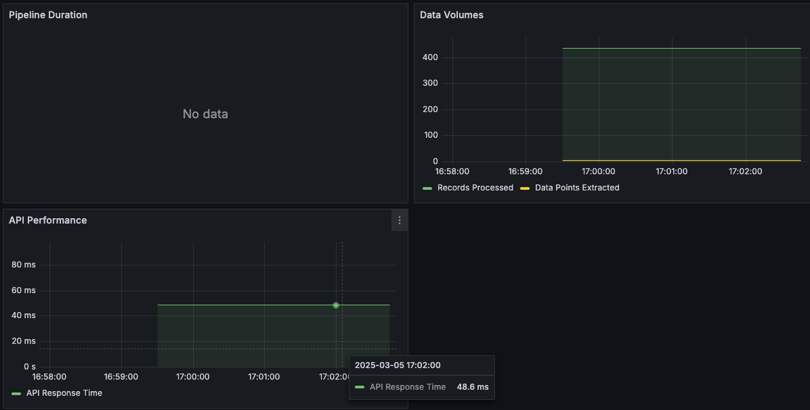
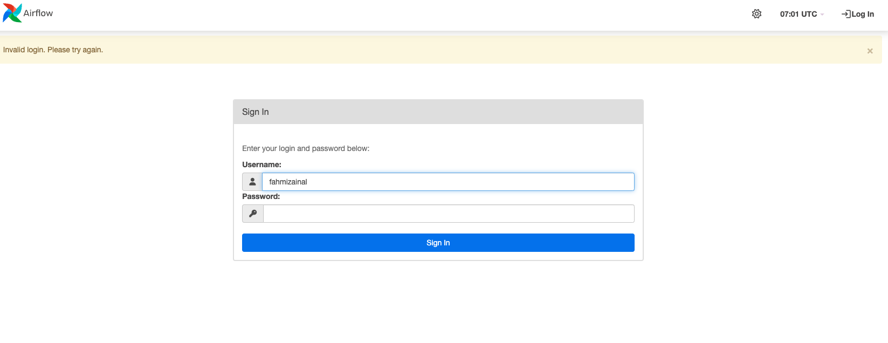
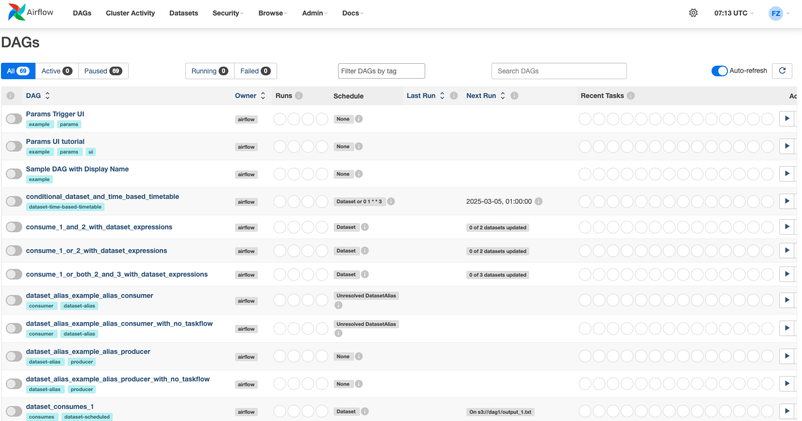
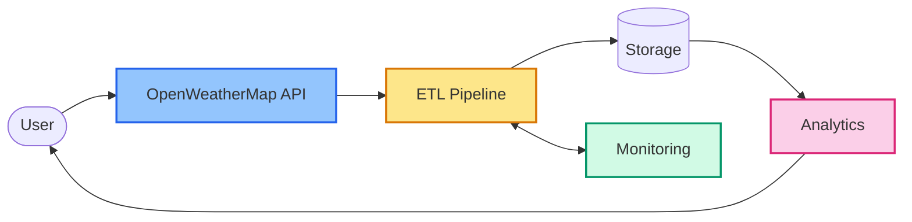
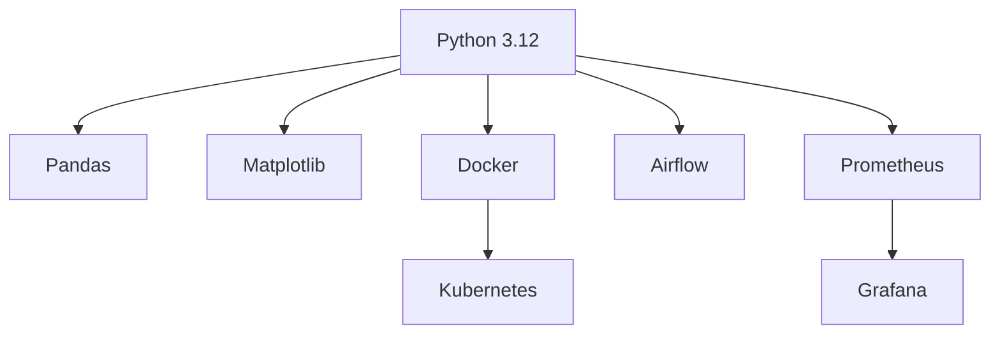
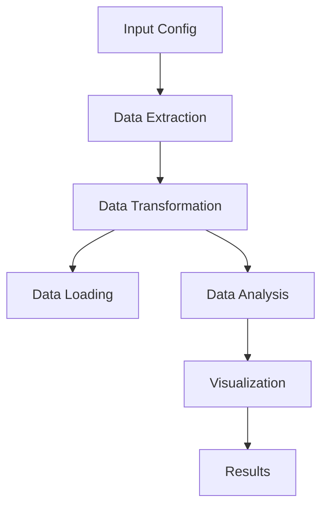
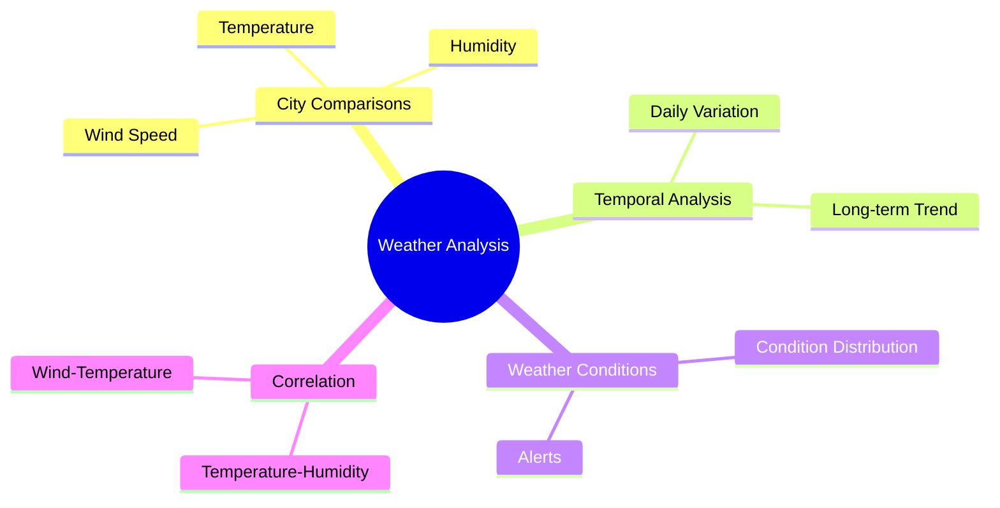

# **🌤️ OpenWeatherMap Data Pipeline Engineering Project**

## **1. Screenshots**

1. **Docker Compose Containers**  
     
   This shows Docker running our containers for the weather pipeline, Prometheus, and Grafana.

2. **Grafana Dashboard**  
     
   Displays the pipeline metrics (data volumes, durations, API performance) once properly configured.

3. **Airflow Login Page**  
     
   Airflow prompts for username and password to access its web UI.

4. **Airflow DAGs Interface**  
     
   A list of DAGs (pipelines) that can be scheduled and monitored via Airflow.

---

## **2. Overview**

The **OpenWeatherMap Data Pipeline Engineering Project** is a comprehensive data engineering solution to collect, process, and analyze weather data from the OpenWeatherMap API. It demonstrates a complete ETL pipeline with integrated monitoring, visualization, and multiple deployment options.



---

## **3. Table of Contents**
1. [Key Features](#4-key-features)  
2. [Technology Stack](#5-technology-stack)  
3. [Project Structure](#6-project-structure)  
4. [Installing & Running (The Story)](#7-installing--running-the-story)  
5. [Processing Pipeline](#8-processing-pipeline)  
6. [Data Analysis](#9-data-analysis)  
7. [Deployment Options](#10-deployment-options)  
8. [Monitoring](#11-monitoring)  
9. [References](#12-references)  
10. [License](#13-license)  

---

## **4. Key Features**

- **Automated Weather Data Collection**  
  - Multi-city weather data extraction  
  - Configurable sampling frequency  
  - Resilient retry logic for API calls  

- **Robust Data Processing**  
  - Data cleaning, outlier handling  
  - Derived metric computation  

- **Comprehensive Analytics**  
  - City-to-city comparisons  
  - Temperature trend analysis  
  - Weather pattern visualizations  

- **Enterprise-Grade Infrastructure**  
  - Docker containerization  
  - Kubernetes orchestration  
  - Optional Airflow scheduling  

---

## **5. Technology Stack**

- **Python 3.12+**  
- **Docker** / **Kubernetes**  
- **Prometheus** / **Grafana**  
- **Apache Airflow** (for advanced scheduling)  



---

## **6. Project Structure**

```plaintext
weather_data_pipeline/
├── README.md
├── images/
│   ├── Grafana.png
│   ├── apache_airflow_interface.png
│   ├── apache_airflow_login.png
│   └── docker-compose up.png
├── config/
│   └── config.yaml
├── data/
│   ├── raw/
│   ├── processed/
│   └── output/
├── logs/
├── requirements.txt
├── src/
│   ├── extract.py
│   ├── transform.py
│   ├── load.py
│   ├── analyze.py
│   └── utils.py
├── main.py
├── Dockerfile
├── docker-compose.yml
├── airflow/
│   └── weather_pipeline_dag.py
├── kubernetes/
│   └── deployment.yaml
└── monitoring/
    ├── prometheus.yml
    └── grafana-dashboard.json
```

---

## **7. Installing & Running (The Story)**

Below is a **step-by-step flow** illustrating how to install Docker, confirm everything is up and running, then transition to Kubernetes and Airflow.

### **Step 1: Install & Verify Docker**

1. **On macOS**, ensure Docker is not stuck:  
   ```bash
   sudo launchctl remove com.docker.vmnetd
   ```
2. **Verify Docker commands**:
   ```bash
   docker pull hello-world
   docker run hello-world
   docker ps
   docker ps -a
   docker --version
   ```
3. **Check existing images & remove any** (optional):  
   ```bash
   docker images
   docker rmi <IMAGE_ID>
   ```
4. **Open Docker Desktop GUI** (macOS):  
   ```bash
   open -a Docker
   ```

### **Step 2: Build & Run Our Weather Pipeline**

1. **Build the Docker image**:
   ```bash
   docker build -t weather-pipeline .
   ```
2. **Run the container** with your API key:
   ```bash
   docker run --env-file .env weather-pipeline
   ```
3. **Spin up services** via Docker Compose:
   ```bash
   docker compose up
   ```
   > If you get a **port conflict** (e.g., for port 9090), try:
   > ```bash
   > lsof -i :9090
   > kill -9 <PID>
   > pkill -f prometheus
   > docker compose up
   > ```

4. **Check Docker containers**:
   ```bash
   docker ps
   ```
   **Screenshot**:  
   

   You should see **3 containers**:
   - Weather Pipeline (port 8000)  
   - Prometheus (port 9090)  
   - Grafana (port 3000)  

### **Step 3: Monitor Pipeline with Grafana**

Once Docker is up, open Grafana at [http://localhost:3000](http://localhost:3000).  
- **Username**: `admin`  
- **Password**: `admin` (by default, if unchanged)

**Screenshot**:  


You’ll see panels for:
- **Pipeline Duration**  
- **Data Volumes** (Records Processed & Data Points Extracted)  
- **API Performance**  

> If you see “No data,” check your `prometheus.yml` or the pipeline’s main logs to ensure metrics are being scraped properly.

### **Step 4: Using Airflow Locally**

**Screenshot** (Login):  


1. **Install & Initialize Airflow**:
   ```bash
   pip install apache-airflow
   airflow db init
   ```
2. **Create Admin User**:
   ```bash
   airflow users create \
     --username admin \
     --password admin \
     --firstname Admin \
     --lastname User \
     --role Admin \
     --email admin@example.com
   ```
3. **Add the DAG**:
   ```bash
   mkdir -p ~/airflow/dags
   cp airflow/weather_pipeline_dag.py ~/airflow/dags/
   ```
4. **Start Airflow**:
   ```bash
   airflow webserver --port 8080
   airflow scheduler
   ```
5. **Screenshot** (DAGs):  
     
   You should now see a list of DAGs (pipelines). Enable or trigger the relevant ones.

### **Step 5: Kubernetes (Optional)**

1. **Start Minikube**:
   ```bash
   minikube start
   ```
2. **Apply the Weather Pipeline Deployment**:
   ```bash
   kubectl apply -f kubernetes/deployment.yaml
   ```
3. **(Optional) Create a secret** for your API key:
   ```bash
   kubectl create secret generic weather-pipeline-secrets \
       --from-literal=API_KEY=your_openweathermap_api_key
   ```
4. **Check pods**:
   ```bash
   kubectl get pods
   ```
Now your pipeline can run in a Kubernetes environment!

---

## **8. Processing Pipeline**


1. **Extract**: Grab weather data from OpenWeatherMap  
2. **Transform**: Clean, normalize, handle outliers  
3. **Load**: Store processed data in local files or DB  
4. **Analyze**: Generate city comparisons, identify trends  
5. **Visualize**: Plot charts & graphs (Matplotlib, etc.)

---

## **9. Data Analysis**



The pipeline can generate:
- **Time-series** plots (temperature trends)  
- **Comparison** charts across multiple cities  
- **Correlation** analyses (humidity vs. temperature)  

---

## **10. Deployment Options**

- **Local Docker**: `docker-compose up --build`  
- **Kubernetes (Minikube)**: `minikube start && kubectl apply -f deployment.yaml`  
- **Airflow**: Local scheduler and UI (port `8080`)  
- **EC2**: GitHub Actions CI/CD for continuous deployment  

---

## **11. Monitoring**

1. **Prometheus** collects pipeline metrics (port `9090`).  
2. **Grafana** visualizes metrics (port `3000`).  
   - Import `monitoring/grafana-dashboard.json` for a pre-built dashboard.  
3. **Alerts** can be configured in Prometheus/Grafana to notify on pipeline failures or anomalies.

---

## **12. References**

- [OpenWeatherMap API Docs](https://openweathermap.org/api)  
- [Docker Documentation](https://docs.docker.com/)  
- [Kubernetes Docs](https://kubernetes.io/docs/home/)  
- [Prometheus Docs](https://prometheus.io/docs/introduction/overview/)  
- [Grafana Docs](https://grafana.com/docs/grafana/latest/)  
- [Apache Airflow Docs](https://airflow.apache.org/docs/)

---

## **13. License**

```
© 2025 Fahmi Zainal

All rights reserved. This project and its contents are proprietary and 
confidential. Unauthorized copying, distribution, or modification of 
this software, via any medium, is strictly prohibited. For licensing 
inquiries, please contact the project maintainer.
```

---
